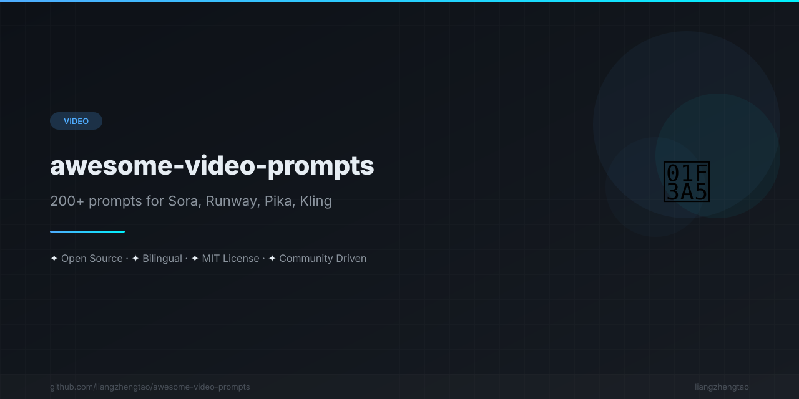

[English](README.md) | [中文](README.zh.md) | [日本語](README.ja.md) | [Français](README.fr.md) | [Español](README.es.md)

<div align="center">



</div>


# Awesome Video Prompts

[](https://awesome.re)
[](CONTRIBUTING.md)
[](LICENSE)
[](#プロンプトコレクション)

**曖昧なプロンプトはもうやめましょう。Sora、Runway、Pika、Kling 向けの実績 200 本以上の動画生成プロンプト集です。**

---

## 問題

**悪いプロンプト：**
> "a cat walking"

**結果：** ランダムな猫、ランダムな場所、ランダムな品質。何度やっても同じ。

---

## 解決策

**良いプロンプト：**
> "A ginger tabby cat walks slowly along a rain-soaked cobblestone alley at dusk. Camera follows from behind at cat height, 35mm lens. Warm streetlamp light creates long shadows. Puddles reflect the neon signs above. Shot on ARRI Alexa, cinematic color grade, film grain."

**結果：** 思い描いた通りの映像が一発で完成。

---

## クイックスタート

1. **参照** — 以下のプロンプトコレクションを閲覧
2. **コピー** — プロジェクトに合ったプロンプトをコピー
3. **貼り付け** — AI 動画ツールに貼り付け
4. **調整** — 細部をビジョンに合わせて微調整
5. **生成** — 期待通りの結果を取得

---

## プロンプトエンジニアリング チートシート

### 動画プロンプトの構造

```
[Subject] + [Action] + [Environment] + [Camera] + [Lighting] + [Style] + [Quality]
```

### 基本カメラワーク

| 動き | プロンプト例 |
|------|-------------|
| パン | Camera pans left to right |
| チルト | Camera tilts up from ground to sky |
| ドリー | Camera dollies toward the subject |
| トラッキング | Camera tracks alongside the runner |
| クレーン | Camera cranes up to 30ft overhead |
| ドローン | Aerial drone shot descending from 200ft |
| オービット | Camera orbits 360° around the subject |
| ステディカム | Steadicam follows through the hallway |
| ハンドヘルド | Slight handheld shake, documentary feel |
| 固定 | Camera locked on tripod, no movement |

### 基本ライティング

| ライティング | プロンプト例 |
|-------------|-------------|
| ゴールデンアワー | Warm light, long shadows, 30 min before sunset |
| ブルーアワー | Deep blue ambient, 20 min after sunset |
| リムライト | Strong backlight on subject edges |
| ボリューメトリック | Light shafts through fog/dust |
| 曇り | Soft, diffused, no hard shadows |
| ネオン | Pink, blue, electric green reflections |
| キャンドルライト | Warm flickering, intimate shadows |
| キアロスクーロ | Single hard light, deep shadows |

### プロのコツ

- **レンズを指定する**："21mm wide angle" や "200mm telephoto" — 焦点距離で映像が変わる
- **撮影監督を名指きする**："In the style of Roger Deakins" で AI に明確な目標を示す
- **雰囲気を描写する**："A sense of quiet loneliness" > "empty room"
- **1 つのプロンプトに 1 つのアクション**：10 個のアクションをつなげない。1 つの瞬間に集中する。
- **ネガティブ指示を含める**："No camera shake, no lens flare" — 何を避けるべきか伝える

---

## プロンプトコレクション

### Sora (OpenAI)

| カテゴリ | 説明 | プロンプト数 | ファイル |
|---------|------|-------------|---------|
| 🎬 シネマティックショット | 建立ショット、トラッキングショット、ドリーズーム、空撮、タイムラプス | 25+ | [cinematic-shots.md](prompts/Sora/cinematic-shots.md) |
| 📖 ナラティブシーン | キャラクターアクション、会話、感情的な瞬間、葛藤と解決 | 25+ | [narrative-scenes.md](prompts/Sora/narrative-scenes.md) |
| 🛍️ プロダクトショーケース | 製品のお披露目、開封、ライフスタイルショット、クローズアップ | 20+ | [product-showcase.md](prompts/Sora/product-showcase.md) |

### Runway Gen-3

| カテゴリ | 説明 | プロンプト数 | ファイル |
|---------|------|-------------|---------|
| 🎨 モーショングラフィックス | 液体アニメーション、パーティクル効果、幾何学変換、テキスト | 25+ | [motion-graphics.md](prompts/Runway/motion-graphics.md) |
| 📸 リアルなシーン | 人物、動物、環境、天候、車両 | 25+ | [realistic-scenes.md](prompts/Runway/realistic-scenes.md) |
| 🖌️ スタイルトランスファー | 印象派、サイバーパンク、フィルム・ノワール、ジブリ、ウェス・アンダーソン | 20+ | [style-transfer.md](prompts/Runway/style-transfer.md) |

### Pika

| カテゴリ | 説明 | プロンプト数 | ファイル |
|---------|------|-------------|---------|
| 📱 ショートフォーム | TikTok/Reels/Shorts スタイル、ミーム、ループ映像 | 25+ | [short-form-content.md](prompts/Pika/short-form-content.md) |
| ✏️ アニメーションスタイル | 2D アニメ、3D レンダー、ドット絵、クレイアニメーション | 20+ | [animation-style.md](prompts/Pika/animation-style.md) |
| ✨ エフェクトと変形 | モーフィング、爆発、天候効果、タイムマニピュレーション | 20+ | [effects-and-transformations.md](prompts/Pika/effects-and-transformations.md) |

### Kling

| カテゴリ | 説明 | プロンプト数 | ファイル |
|---------|------|-------------|---------|
| 🏃 ヒューマンセントリック | ダンス、スポーツ、料理、手芸、パフォーマンス | 25+ | [human-centric.md](prompts/Kling/human-centric.md) |
| 🌿 自然と動物 | 風景、野生動物、天候、季節、マクロ/広角 | 20+ | [nature-and-animals.md](prompts/Kling/nature-and-animals.md) |
| 🏯 中国美学 | 水墨画、古代建築、武術、詩的意境、伝統文化 | 20+ | [chinese-aesthetics.md](prompts/Kling/chinese-aesthetics.md) |

### ガイド

| ガイド | 説明 | ファイル |
|-------|------|---------|
| 📚 プロンプトエンジニアリング | カメラ用語、ライティング用語、フィルムストックリファレンス、よくあるミス | [prompt-engineering.md](prompts/通用技巧/prompt-engineering.md) |
| 🎨 スタイルキーワード | 200 以上のスタイルキーワードをカテゴリ別に整理：ビジュアルスタイル、色彩、テクスチャ、雰囲気 | [style-keywords.md](prompts/通用技巧/style-keywords.md) |

---

## ツール比較

| 特徴 | Sora | Runway Gen-3 | Pika | Kling |
|------|------|-------------|------|-------|
| **得意分野** | ナラティブ、シネマティック | モーショングラフィックス、抽象 | SNS、アニメーション | 人物の動き、自然 |
| **最大時間** | 60s | 10s | 4s | 10s |
| **フォトリアリズム** | ★★★★★ | ★★★★ | ★★★ | ★★★★ |
| **アニメーション** | ★★★ | ★★★★ | ★★★★★ | ★★★ |
| **人物の動き** | ★★★★ | ★★★ | ★★★ | ★★★★★ |
| **スタイルトランスファー** | ★★★ | ★★★★★ | ★★★★ | ★★★ |
| **アスペクト比** | 16:9, 9:16, 1:1 | 16:9, 9:16, 1:1 | 16:9, 9:16, 1:1, 4:5 | 16:9, 9:16 |

### ツールの選び方

- **Sora**：ナラティブ、カメラワーク、シネマティックな品質を備えた完全なシーンが必要なとき
- **Runway**：モーショングラフィックス、抽象的なビジュアル、強いスタイルトランスファーが必要なとき
- **Pika**：短くてパンチの効いた SNS コンテンツやアニメーションスタイルが必要なとき
- **Kling**：人物の動き、料理、ダンス、中国美学が中心の動画が必要なとき

---

## コントリビューション

プロンプトの投稿を歓迎します！フォーマットとガイドラインは [CONTRIBUTING.md](CONTRIBUTING.md) をご覧ください。

**コントリビューション方法：**
1. このリポジトリをフォーク
2. [テンプレートフォーマット](CONTRIBUTING.md#prompt-format)に従ってテスト済みプロンプトを追加
3. Pull Request を送信
4. レビュー後にマージ

---

## プロジェクト構成

```
awesome-video-prompts/
├── README.md                          ← ここ
├── LICENSE                            ← MIT ライセンス
├── CONTRIBUTING.md                    ← コントリビューションガイドライン
├── CHANGELOG.md                       ← バージョン履歴
├── prompts/
│   ├── Sora/                          ← OpenAI Sora プロンプト
│   │   ├── cinematic-shots.md         ← 25+ シネマティックプロンプト
│   │   ├── narrative-scenes.md        ← 25+ ナラティブプロンプト
│   │   └── product-showcase.md        ← 20+ プロダクトプロンプト
│   ├── Runway/                        ← Runway Gen-3 プロンプト
│   │   ├── motion-graphics.md         ← 25+ モーショングラフィックスプロンプト
│   │   ├── realistic-scenes.md        ← 25+ リアルシーンプロンプト
│   │   └── style-transfer.md          ← 20+ スタイルトランスファープロンプト
│   ├── Pika/                          ← Pika プロンプト
│   │   ├── short-form-content.md      ← 25+ SNS プロンプト
│   │   ├── animation-style.md         ← 20+ アニメーションプロンプト
│   │   └── effects-and-transformations.md ← 20+ エフェクトプロンプト
│   ├── Kling/                         ← Kling プロンプト
│   │   ├── human-centric.md           ← 25+ 人物プロンプト
│   │   ├── nature-and-animals.md      ← 20+ 自然プロンプト
│   │   └── chinese-aesthetics.md      ← 20+ 中国美学プロンプト
│   └── 通用技巧/                       ← 汎用テクニック
│       ├── prompt-engineering.md      ← プロンプトエンジニアリング完全ガイド
│       └── style-keywords.md          ← 200+ スタイルキーワードリファレンス
└── .github/
    ├── workflows/ci.yml               ← CI パイプライン
    ├── ISSUE_TEMPLATE/                ← Issue テンプレート
    └── pull_request_template.md       ← PR テンプレート
```

---

## 関連リンク

- [awesome-chatgpt-prompts](https://github.com/f/awesome-chatgpt-prompts) — ChatGPT プロンプトコレクション
- [awesome-prompts](https://github.com/DAGWorks-Inc/awesome-prompts) — マルチモーダルプロンプトコレクション
- [awesome-ai-tools](https://github.com/mahseema/awesome-ai-tools) — AI ツール精选リスト
- [awesome-generative-ai](https://github.com/steven2358/awesome-generative-ai) — 生成 AI リソース
- [awesome-stable-diffusion](https://github.com/underctrlanatomy/awesome-stable-diffusion) — Stable Diffusion リソース
- [awesome-midjourney-prompts](https://github.com/willwulfken/awesome-midjourney-prompts) — Midjourney プロンプトコレクション

---

## ライセンス

本プロジェクトは MIT ライセンスの下で公開されています。詳細は [LICENSE](LICENSE) ファイルをご覧ください。

Copyright (c) 2026 liangzhengtao
